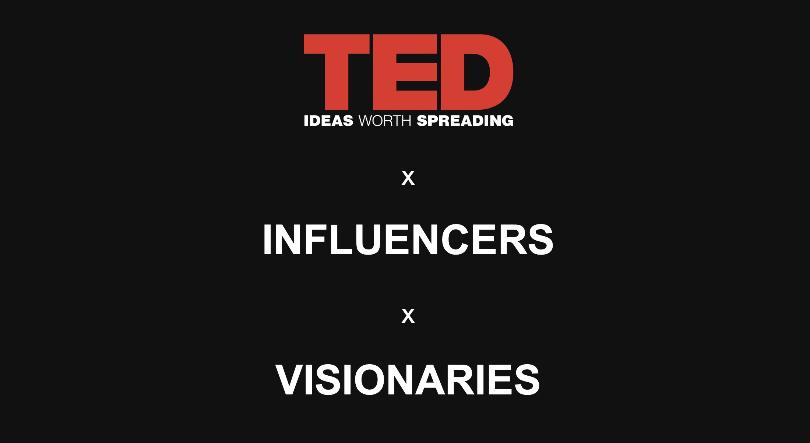

# Brainstation 3D Hackathon: TED_Talks_Analysis

 

  

## Introduction 
A Brainstation 3D Hackathon event is about Data Science + UX Design + Web Development three disciplines come together and build a functional application within 8 hours. Also, it's showing the skills we have developed in each program, learning new concepts from peers, and practicing communicating within cross-functional teams.

## Topic
How might we help influencers gain insight on their TED Talks in order to improve performance and produce better content?

Ted influencers have no way to access the data and feedback behind their videos, even though it is readily available. We want to give influencers the ability to receive feedback and gauge the success of SEO/title practices within the app. By providing influencers with this information, they will be able to improve future talks and create even more meaningful content. 

## Dataset From Kaggle 
These datasets contain information about all audio-video recordings of TED Talks uploaded to the official TED.com website until September 21st, 2017. The TED main dataset contains information about all talks including number of views, number of comments, descriptions, speakers and titles. The TED transcripts dataset contains the transcripts for all talks available on TED.com.

Dataset link: https://www.kaggle.com/rounakbanik/ted-talks  
Dataset Credit: Rounak Banik

## Team: Visionaries
Data Science Team:  
Austin Yu  
Kaity Castellani  
Karla Muller  

Web Dev Team:  
Brian Alves  
Derek So  
Alana  

UX Design Team:  
Franka Mostert  
Paul Wang  

LinkedIn Page: https://www.linkedin.com/feed/update/urn:li:activity:6643727980877099008/
